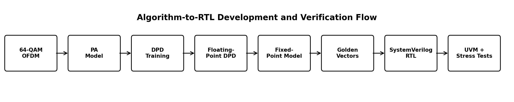
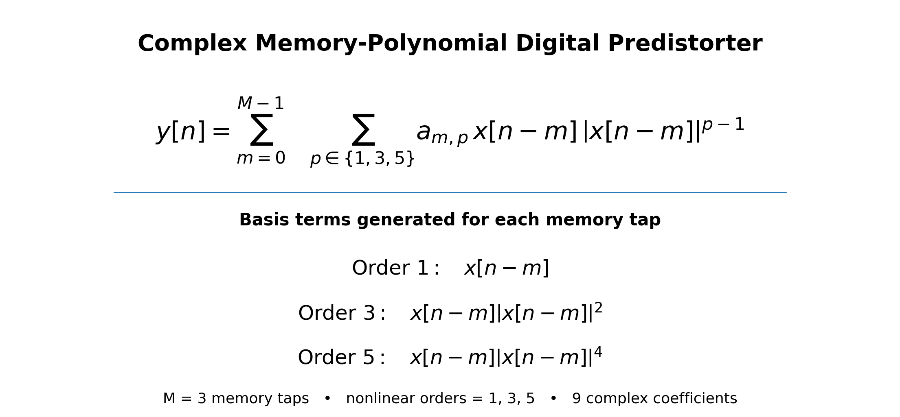

# Digital Predistortion for RF Power-Amplifier Linearization

A Python-to-SystemVerilog implementation of a fixed-point memory-polynomial digital predistorter, verified with golden vectors, SystemVerilog assertions, UVM 1.2, functional coverage, randomized stress, reset recovery, and negative protocol testing.

> **Current scope:** algorithm development, fixed-point modeling, bit-accurate RTL, and verification are complete. Synthesis and hardware deployment are not included yet.

## Why this project exists

RF power amplifiers are most power-efficient when operated close to saturation. Unfortunately, this is also where they become nonlinear.

A nonlinear PA does not produce a perfectly scaled copy of its input. It introduces:

- Gain compression
- Phase distortion
- In-band modulation error
- Spectral regrowth
- Adjacent-channel interference

Operating the PA farther below saturation improves linearity, but wastes available output power and reduces efficiency.

Digital predistortion addresses this tradeoff by applying an approximate inverse nonlinear response before the PA. The signal is intentionally distorted first so that the predistorter and amplifier distortions approximately cancel.

'''text
Original signal
      ↓
Digital predistorter
      ↓
Predistorted signal
      ↓
Nonlinear power amplifier
      ↓
More linear transmitted signal
'''

This project was created to explore the complete engineering path from the DSP algorithm to a cycle-accurate, bit-accurate RTL implementation and a structured verification environment.

---

## Project goals

The project was designed to answer five practical questions:

1. Can a memory-polynomial DPD improve a nonlinear OFDM signal chain?
2. Can the floating-point algorithm be converted into a safe fixed-point specification?
3. Can the fixed-point model be implemented exactly in SystemVerilog RTL?
4. Can Python and RTL be correlated sample-for-sample?
5. Can the design be verified under normal traffic, backpressure, reset, coefficient changes, and invalid protocol behavior?

The completed project demonstrates all five.

---

## Development flow

The signal-processing chain is:

'''text
64-QAM OFDM
    ↓
Digital predistorter
    ↓
Wiener + Rapp + AM/PM PA model
    ↓
NMSE, EVM, ACPR, and PAPR analysis
'''

---

## Digital predistorter architecture

The predistorter uses the following complex memory-polynomial model:

For this project, the memory depth is **3**. The current sample and the previous two accepted samples each produce three nonlinear basis terms:

| Term | Expression | Purpose |
|---|---|---|
| Linear | 'x[n-m]' | Controls ordinary gain and phase |
| Third order | 'x[n-m] . |x[n-m]|²' | Corrects moderate nonlinear distortion |
| Fifth order | 'x[n-m] . |x[n-m]|⁴' | Corrects stronger nonlinear distortion |

Where:

- 'x[n]' is the current complex input sample.
- 'x[n-m]' is the input delayed by 'm' accepted samples.
- 'y[n]' is the complex predistorted output.
- 'a[m,p]' is the complex coefficient for memory tap 'm' and nonlinear order 'p'.
- 'm = 0, 1, 2' selects the current sample or one of the two stored samples.
- 'p = 1, 3, 5' selects the nonlinear order.

There are **3 memory taps . 3 nonlinear orders = 9 complex coefficients**. Each basis term is multiplied by its coefficient, and all nine weighted terms are added to produce the DPD output.

The implemented model contains:

'''text
Memory taps:          3
Nonlinear orders:     1, 3, 5
Complex coefficients: 9
Input format:         signed Q1.15
Output format:        signed Q1.15
'''

---

## OFDM waveform

| Parameter | Value |
|---|---:|
| Modulation | 64-QAM |
| OFDM symbols | 32 |
| Base FFT size | 256 |
| Oversampled IFFT size | 1024 |
| Oversampling | 4. |
| Active subcarriers | 192 |
| Samples | 36,864 |
| RMS target | 0.2 |
| Random seed | 12345 |
| Measured PAPR | 9.83 dB |

The high PAPR makes OFDM a useful stress case for PA nonlinearity and predistortion.

---

## Power-amplifier model

The behavioral PA combines:

- A Wiener FIR filter for memory effects
- Rapp AM/AM compression
- AM/PM phase distortion

The uncorrected PA produced:

| Metric | Result |
|---|---:|
| NMSE | -16.72 dB |
| EVM | 11.65% |
| Input ACPR | -20.53 dB |
| Output ACPR | -17.94 dB |
| Output PAPR | 4.06 dB |

---

## DPD training

The coefficients are trained in Python using an indirect learning architecture.

'''text
Known PA input and output
        ↓
Construct memory-polynomial basis matrix
        ↓
Solve complex least-squares problem
        ↓
Estimate inverse PA model
        ↓
Use the inverse model as the predistorter
'''

A validation guard prevents a later iteration from replacing a better coefficient set with a worse one.

The trained floating-point DPD achieved:

| Metric | Result |
|---|---:|
| Target NMSE | -25.18 dB |
| Best-fit NMSE | -25.25 dB |
| NMSE improvement vs PA | 8.53 dB |
| EVM | 3.88% |
| ACPR | -19.93 dB |

---

## Fixed-point design

| Quantity | Format |
|---|---|
| Input/output sample | Signed Q1.15 |
| Coefficient | Signed 24-bit Q8.16 |
| Basis term | Q4.20 |
| Product | Q12.36 |
| Complex term | Q13.36 |
| Accumulator | Q18.36 |

Arithmetic rules include:

- Nearest rounding
- Halfway cases rounded away from zero
- Saturation on basis, coefficient, and output
- Accumulator overflow treated as an error
- Order-specific binary-point alignment

Measured fixed-point agreement:

| Metric | Result |
|---|---:|
| Coefficient saturation | 0 |
| Input/basis saturation | 0 |
| Maximum coefficient error | 9.21e-6 |
| Fixed vs floating DPD NMSE | -77.85 dB |
| Fixed vs floating RMS error | 2.18e-5 |

---

## RTL implementation

The SystemVerilog RTL implements the complete nine-term complex memory polynomial.

Key properties:

- One-cycle registered output latency
- One sample per clock when downstream is ready
- Ready/valid flow control
- Correct output stability during backpressure
- Input history updates only on accepted transfers
- Runtime coefficient inputs
- Exact rounding and saturation behavior
- Bit-accurate agreement with Python

Full direct RTL regression:

'''text
Samples checked:             36,864
Cycle count:                 43,085
Latency:                     1 cycle
Accepted samples per cycle:  0.855611
Exact integer match:         true
Forbidden RTL warnings:      0
'''

---

## Verification strategy

The project uses several verification layers.

### Python unit tests

'''text
116 passing tests
'''

The tests cover OFDM generation, spectral analysis, PA behavior, DPD training, fixed-point quantization, rounding, saturation, bit-accurate arithmetic, and vector export.

### Golden-vector RTL regression

Python exports exact two's-complement hexadecimal vectors for:

- Input I and Q
- Expected output I and Q
- Complex coefficients
- Debug traces
- Manifests and hashes

The RTL is compared against the expected Python integer result for every sample.

### UVM 1.2

The UVM environment contains:

- Sequence and sequencer
- Ready/valid driver
- Output monitor
- Exact scoreboard
- Functional coverage
- Reset-aware randomized checking
- Protocol assertions

The full UVM test produced:

'''text
Input transfers:        36,864
Output transfers:       36,864
Mismatches:             0
UVM warnings:           0
UVM errors:             0
UVM fatals:             0
Stream coverage:        96.97%
Saturated outputs:      66
Maximum output stall:   2 cycles
'''

### Functional coverage

| Coverage item | Result |
|---|---:|
| Input quadrants | 4/4 |
| Output quadrants | 4/4 |
| Input magnitude bins | 4/4 |
| Output magnitude bins | 4/4 |
| Protocol states | 6/6 |
| Ready states | 2/2 |
| Saturation states | 2/2 |

### Randomized stress

Three deterministic seeds exercised random complex inputs, random input gaps, random output backpressure, reset while an output was stalled, and identity → zero → identity coefficient updates.

'''text
Accepted inputs:          6,144
Checked outputs:          6,141
Reset-flushed outputs:        3
Mismatches:                   0
Unexpected outputs:           0
Coefficient updates:          9
Maximum observed stall:      13 cycles
'''

### Negative protocol testing

The testbench intentionally violates both streaming stability rules and confirms that assertions detect them:

- Input changed before acceptance
- Output changed while backpressured

These are expected-failure tests. They pass only when the correct assertion fires.

---

## Repository structure

The repository is organized by responsibility rather than by milestone:

| Path | Purpose |
|---|---|
| 'python/dpd/' | Core Python models for OFDM generation, PA behavior, DPD training, fixed-point arithmetic, and vector export |
| 'python/scripts/' | Executable workflows for analysis, plotting, reporting, and golden-vector generation |
| 'python/tests/' | Pytest unit tests for the Python implementation |
| 'rtl/' | Final SystemVerilog package and bit-accurate DPD core |
| 'verification/uvm/' | Main UVM environment for golden-vector regression |
| 'verification/uvm_stress/' | Randomized backpressure, reset, and coefficient-update tests |
| 'verification/negative/' | Expected-failure tests that confirm interface assertions detect protocol violations |
| 'simulation/' | Altair DSim file lists and Python regression runners |
| 'vectors/rtl/' | Python-generated input samples, coefficients, and expected RTL outputs |
| 'reports/results/' | Small JSON summaries of completed regressions |
| 'reports/plots/' | Selected signal-processing and verification plots |
| 'docs/' | Architecture, verification, and portfolio documentation |

---

## Running the project

### Requirements

- Python 3.11 or newer
- NumPy
- pytest
- Altair DSim 2026
- UVM 1.2

### Activate the Python environment

'''powershell
.\.venv\Scripts\Activate.ps1
'''

### Run Python tests

'''powershell
python -m pytest
'''

### Run the full direct RTL regression

'''powershell
python .\simulation\run_dpd_core_full.py
'''

### Run the full UVM regression

'''powershell
python .\simulation\run_uvm_full.py
'''

### Run randomized stress and negative tests

'''powershell
python .\simulation\run_milestone_13.py
'''

Expected final marker:

'''text
MILESTONE_13_STRESS_REGRESSION_PASS
'''

---

## Engineering skills demonstrated

- RF behavioral modeling
- 64-QAM OFDM generation
- Digital predistortion
- Indirect learning architecture
- Complex memory-polynomial modeling
- Fixed-point numerical design
- Bit-accurate Python-to-RTL correlation
- Ready/valid streaming RTL
- SystemVerilog assertions
- UVM verification architecture
- Functional coverage closure
- Randomized reset and backpressure testing
- Negative protocol verification

---

## Current limitations

- The PA is a behavioral software model rather than measured hardware.
- Coefficients are trained offline and loaded into the DUT.
- Adaptive on-chip coefficient training is not implemented.
- The RTL has not been synthesized.
- FPGA and ASIC timing, area, and power results are not included.
- No physical RF transmitter or laboratory PA was used.

These limitations define the current project boundary and avoid overstating the implementation status.

---

## Future extensions

Possible future work includes:

- Online or adaptive coefficient updates
- Measured PA data
- Additional polynomial orders and memory depths
- Crest-factor reduction
- Wider-band OFDM signals
- Hardware-in-the-loop validation
- FPGA implementation
- Synthesis and timing analysis

---

## Tools

'Python' . 'NumPy' . 'pytest' . 'SystemVerilog' . 'UVM 1.2' . 'SVA' . 'Altair DSim 2026' . 'VS Code' . 'PowerShell' . 'Git' . 'GitHub'

---

## License

This repository is intended as an educational and portfolio project. Add a license file before allowing reuse or redistribution.
